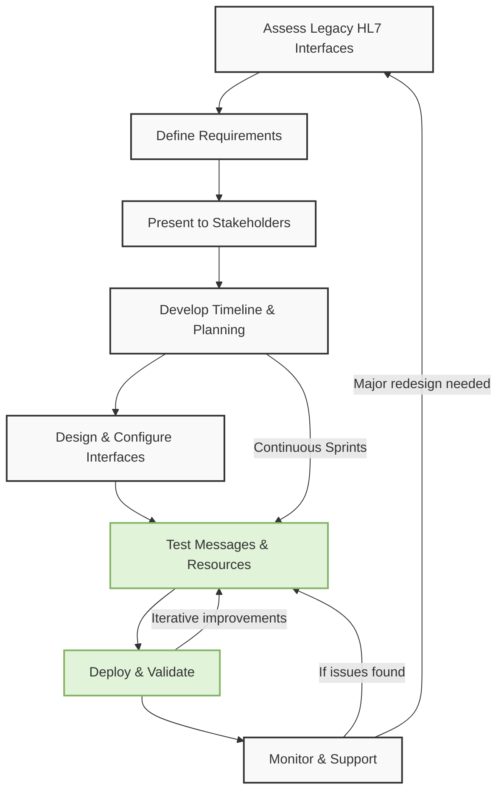

# Healthcare Interface and Data Analytics Portfolio

## About Me

Hello! I'm **Sherminta Lawrence**, a Data & Interface Analyst with over 10 years of experience integrating and analyzing healthcare data. My expertise lies in **HL7 interface migration, HL7/FHIR validation, data analysis and Agile SDLC methodologies**. This repository showcases some of my skills in data analytics and interoperability solutions. 

## Who Should Use This?

This repository is designed for:
- **Healthcare data professionals** looking for examples of HL7/FHIR integration.
- **Data analysts** interested in healthcare-focused JavaScript, SQL, and Python projects.
- **Developers & engineers** working on interoperability solutions.
- **Anyone exploring healthcare data modeling, Software Development Life Cycle (SDLC), and visualization techniques.**

## About the data used in this repository

Real-world patient healthcare data isn't available, however, there are datasets avaialble as well as ways to create our own data using Python. 

How the data used in this repository was created and sourced: 📈 [Practice Data](notebooks/active/FHIR_Project.ipynb)

---
## Tech Stack

- **Programming:** Python, SQL, JavaScript
- **Databases:** PostgreSQL
- **Healthcare Data Standards:** HL7 (ADT, ORM, ORU), FHIR (Patient Resource), JSON Validation
- **Data Processing & ETL:** Pandas, SQLAlchemy, SSIS
- **Data Visualizatio tomorrow when you get home when you get home yeah don't know yet I'm gonna be I'm gonna do it want to be conscious or should be aware be aware listening listening listening OK listening right what more and yes yeah sister a lot anything else I'll call you in the morning rude 15 minutes I'll see you in 15 minutes later please yes OK gymnastics gymnastics 15 minutes you already OK yes hurry upn:** Matplotlib, Seaborn
---

# Mirth HL7 Interface Migration (Case Study)

### **Overview**
**Challenge:** Migrate clients from a legacy VB-based interface to a **Mirth-powered HL7 interface engine** while ensuring seamless data exchange with EMRs like **Epic Beaker, Meditech, Vista, and Cloverleaf.**

**SDLC Approach:**
- Followed **Agile methodology** with sprint-based releases.
- Participated in **backlog grooming, sprint planning, and iterative testing cycles.**
- Conducted **interface validation** using HL7 message types (ADT, ORM, ORU) to ensure compliance.
- Deployed using **parallel testing strategies** to minimize downtime.

**Solution:**
- Configured and optimized **HL7 transactions (ADT, ORM, ORU)** to align with EMR requirements.
- Developed **FHIR validation scripts** to support JSON-based patient resource exchange.
- Created SQL queries for **data validation and integrity checks** during migration.
- Designed **monitoring workflows** to track message success rates post-migration, utilizing Mirth's channel statistics and built-in dashboards.

**Outcome:**

✅ **Reduced HL7 transaction errors**, improving data reliability.  
✅ **Enhanced interoperability** with major EMRs like Epic Beaker, Meditech, and Cloverleaf.  

### **Legacy Interface to Mirth Migration Workflow**

This diagram illustrates:
1. **Legacy Interface → Mirth Engine Migration Process**
2. **Sprint-based development cycle** (Agile Kanban representation)
3. **Testing & Validation Phases** for HL7 message compliance

## JavaScript for Parsing JSON in Mirth:

Here’s a generalized example of how JavaScript is used in Mirth to parse JSON patient data and create an HL7 message (with error handling).
➡️ [JavaScript for Parsing JSON in Mirth](notebooks/archived/JS_Parse.ipynb)

---

# Data Analysis Projects 

## Features

- **Data Cleaning & Transformation** – Used SQL and Python to handle missing values, outliers, and format inconsistencies, improving data quality for analysis.
- **Predictive Modeling** – Built a logistic regression model to predict hospital readmissions, helping optimize patient care.
- **FHIR Resource Validation** – Developed Python scripts to validate HL7 FHIR patient resources against schema standards.

### **Project 1: Clinical Trial Patient List (JOIN + CASE)**
- **Objective:** Identify eligible patients for a clinical trial based on lab results and demographic data.
- **Skills Used:** SQL joins, CASE statements, filtering, and patient cohort identification.
- **Outcome:** Helped refine patient selection criteria, improving recruitment efficiency.

➡️ [Project 1_Notebook](notebooks/active/Clinical_Trial_List.ipynb)

### **Project 2: FHIR Resource Validation Lite**
- **Objective:** Validate JSON-based FHIR patient resources against HL7 standards.
- **Skills Used:** Python, JSON parsing, schema validation, and FHIR standards.
- **Outcome:** Ensured compliance with FHIR interoperability guidelines, reducing integration errors.

➡️ [Project 2_Notebook][def]

- **Skills Used:** Python, JSON parsing, schema validation, and FHIR standards.

## Future Enhancements
- Expand FHIR validation scripts for more resources (Observations, Encounters, Medications).
- Add more interactive visualizations
- Machine Learning 
- Develop API integrations for real-time data exchange.
- Instructions for how to use this repository.

### **Project 3: Predictive Modeling (In-Progress)**

**Objective:** Predict readmission rates within a 30 day period by generating features from our three data sets:

- Patient_Vitals: Capturing patient health status
- Encounters: Understanding patient visits and length of stay
- Patient_RX: Analyzing medication history

## Contact
For questions or collaboration opportunities, reach out via [LinkedIn](https://linkedin.com/in/shermintalawrence) or email me at **shermintalawrence@gmail.com**.

---

This README is continuously updated as I refine and expand my projects. 🚀

[def]: notebooks/active/FHIR_Project.ipynb