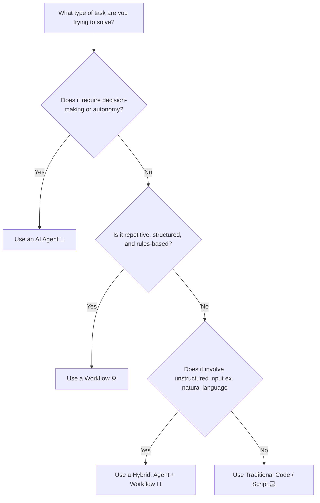

# Do You Really Need an AI Agent? Lessons from Building My First Real App

### 🟦 Intro: The Agent Rabbit Hole

I’m building an app. Not just another coding experiment or weekend test—but my first serious, “real” project. Something I can launch, test with users, and maybe even commercialize.

Once I mapped out the architecture, it hit me: a lot of the tasks in my build could be automated. So instead of hiring expensive resources, I thought, *“Why not use an AI agent?”*

If you’ve spent any time in **YouTube University**, you’ll know there’s no shortage of creators hyping up AI agents promising you can automate complex workflows with just a few lines of code and a sprinkle of OpenAI.

But after watching a dozen videos and digging into frameworks, I had a realization:

> **“AI Agent” is the buzzword of the moment—not the solution to my problem.**

What I needed wasn’t autonomy or decision-making. I needed **execution**.

---

### 🟨 The Real Problem

I wasn’t building a system that needed to reason like a human. I needed help with:

- Fetching and transforming data  
- Code refinement and debugging  
- Generating reports  
- UI/UX scaffolding  
- Basic customer support logic

These are all tasks that are *structured, predictable, and don’t require real-time decisions or learning.*

What I found instead was a confusing blend of tutorials, tools, and buzzwords—many of which blurred the line between **workflows** and **agents**. Worse, many agent frameworks came with major drawbacks: complexity, poor reliability, and hallucination risks.

Just Google *"AI agents hallucinations"*—or look at Microsoft’s now-infamous Copilot mistakes—for examples of why you don’t always want your AI to “think” for itself.

---

### 🟦 The Clarity I Needed

Eventually, I came across [this post from Anthropic](https://www.anthropic.com/engineering/building-effective-agents), which helped me reframe my thinking. Here’s how they break it down:

- **Workflows**: Systems where LLMs and tools are orchestrated through predefined steps. Think rule-based, repeatable, and easy to debug.
- **Agents**: Systems where LLMs dynamically decide how to accomplish tasks. Think autonomy, adaptability, and unpredictability.

That’s when it clicked for me. I didn’t need an “agent.” I needed a smarter, more structured **workflow**.

---

### 🧭 The Framework: Workflow vs. Agent

Here’s a simple flowchart I built to help make the choice clear:

---
### 🟨 Real-World Takeaway
There’s a lot of hype around AI agents right now and for good reason. When used correctly, they can enable powerful applications.

But don’t mistake buzzwords for architecture.

Most of what I needed,(and what a lot of builders need) is structured automation, not cognitive complexity.

Workflows are underrated. They’re simpler, safer, easier to debug, and they work. And when you do need more adaptability, there’s nothing stopping you from layering in agent-like behavior when it makes sense.

### 🔵 Conclusion
If you’re building AI-driven tools, the key question isn’t “How do I build an agent?”

It’s:

“What’s the simplest system that can reliably get this done?”

Don’t get distracted by the noise. Buzzwords won’t ship your product. Execution will.