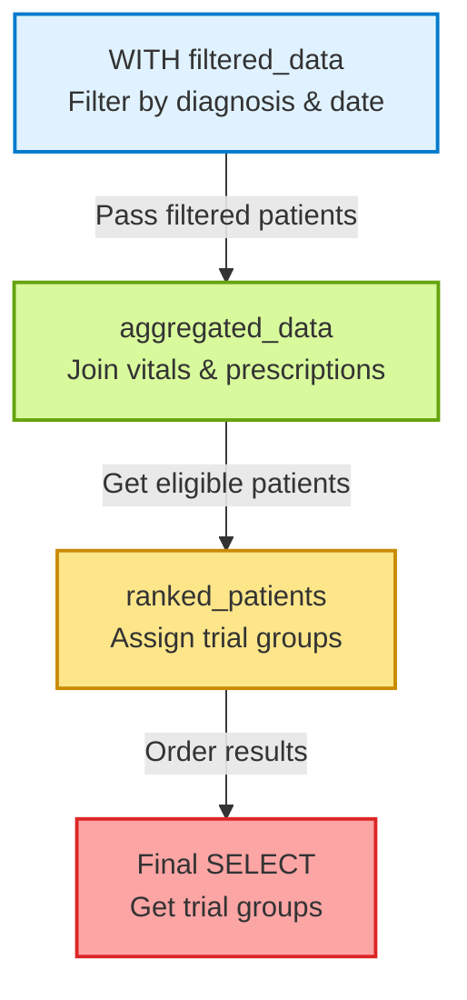

## 🧠 Conceptual Analogy
- Think of CTEs like temporary scratchpads. Each CTE holds a “sub-result” that you’ll build on.

### It’s like a pipeline:

- First, filter the data.

- Then join it with other filtered data.

- Then perform aggregation or classification.

- Each step is a clean, named unit.