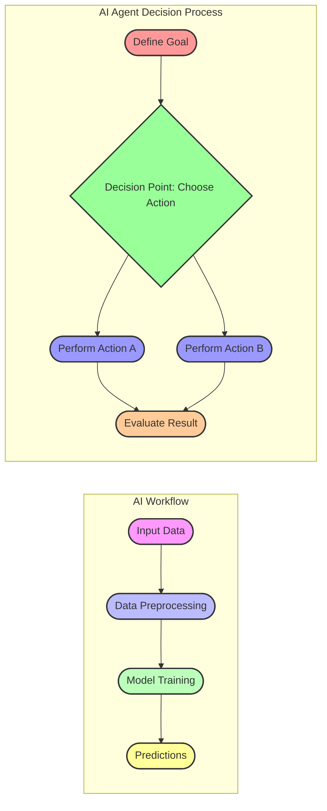

```mermaid
flowchart LR
  %% AI Workflow
  subgraph Workflow [AI Workflow]
    Input([Input Data])
    Step1([Data Preprocessing])
    Step2([Model Training])
    Output([Predictions])
    Input --> Step1 --> Step2 --> Output
  end

  %% AI Agent
  subgraph Agent [AI Agent Decision Process]
    Goal([Define Goal])
    Decision{Decision Point: Choose Action}
    ActionA([Perform Action A])
    ActionB([Perform Action B])
    Result([Evaluate Result])
    Goal --> Decision
    Decision --> ActionA --> Result
    Decision --> ActionB --> Result
  end

  %% Add colors to nodes
  style Input fill:#f9f,stroke:#333,stroke-width:2px
  style Step1 fill:#bbf,stroke:#333,stroke-width:2px
  style Step2 fill:#bfb,stroke:#333,stroke-width:2px
  style Output fill:#ff9,stroke:#333,stroke-width:2px
  style Goal fill:#f99,stroke:#333,stroke-width:2px
  style Decision fill:#9f9,stroke:#333,stroke-width:2px
  style ActionA fill:#99f,stroke:#333,stroke-width:2px
  style ActionB fill:#99f,stroke:#333,stroke-width:2px
  style Result fill:#fc9,stroke:#333,stroke-width:2px
```