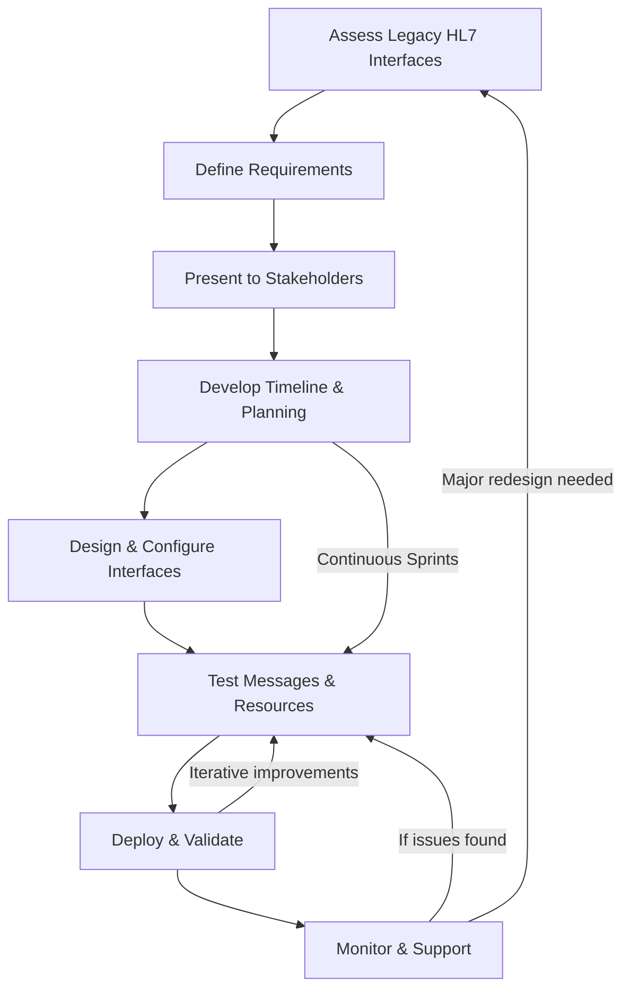

# Mirth HL7 Interface Migration (Case Study)

## Project Overview

### Challenge
Migrate clients from a legacy VB-based interface to a **Mirth-powered HL7 interface engine** while ensuring seamless data exchange with EMRs like **Epic Beaker, Meditech, Vista, and Cloverleaf.**

### SDLC Approach
- Followed **Agile methodology** with sprint-based releases
- Participated in **backlog grooming, sprint planning, and iterative testing cycles**
- Conducted **interface validation** using HL7 message types (ADT, ORM, ORU) to ensure compliance
- Deployed using **parallel testing strategies** to minimize downtime

### Solution
- Configured and optimized **HL7 transactions (ADT, ORM, ORU)** to align with EMR requirements
- Developed **FHIR validation scripts** to support JSON-based patient resource exchange
- Created SQL queries for **data validation and integrity checks** during migration
- Designed **monitoring workflows** to track message success rates post-migration

### Outcome
✅ **Reduced HL7 transaction errors**, improving data reliability  
✅ **Enhanced interoperability** with major EMRs like Epic Beaker, Meditech, and Cloverleaf

## Legacy Interface to Mirth Migration Workflow

## 🔧 Troubleshooting & Monitoring HL7 Interfaces

Common issues encountered and resolved:
- Missing HL7 segments – Using Mirth transformers to insert required fields
- Data mapping errors – Writing JavaScript mappings to properly structure ORU/ORM/ADT messages
- Duplicate messages – Implementing deduplication logic in Mirth

### ✅ Example Debugging Workflow
1. Check Mirth logs for message errors
2. Review ACK/NACK responses from the EMR
3. Use SQL queries to verify data integrity before and after transformation